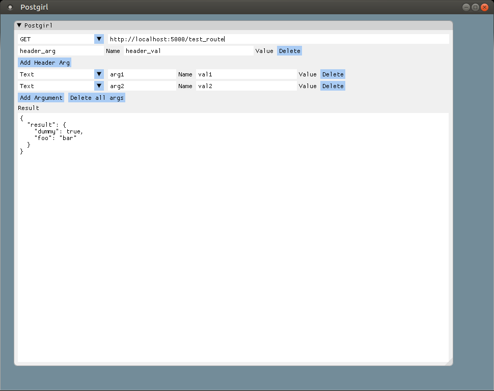

# Postgirl
Postgirl is supposed to be a bloat-free, small and somewhat limited program to do HTTP requests. The idea is to be a simple yet reliable tool to do some quick tests, but being very good at it. It is not in a very useful state right now (it is only working for GETs), but this should change really soon.

This project came from my insatisfaction with [Postman](https://www.getpostman.com/) lately. The native app takes several seconds to boot, sometimes crashes and if you let it open for a long time it may consume an insane amount of RAM (it topped at around 1GB on my Desktop once). Therefore Postgirl, a much simpler alternative.



## Main Development Ideas
This is definitely a toy project of mine. I do indeed pretend to use it on a daily basis, therefore it must be somewhat functional and easy to use, however it is being a playground for tests. Those are some guidelines that I'm trying to follow:

* Minimal external dependencies. Having to install libcurl appart is really bugging me...
* Minimal STL usage: STL is great but it also comes with some costs that are usually ignored such as (sometimes greatly) increased compilation time and horrible stack traces to follow on debug. For example, I added both thread and vector and the main.cpp compilation went from 600ms to 1000ms :( . Looking to remove those on the near future.
* NEVER loose GUI responsiveness
* Cross plataform code: everything here should work on Mac, Windows and Linux.
* Simple code without excessive abstractions

## Future Features
* ~~Add a JSON input field that says if it is a valid JSON on the fly~~
* ~~Add support to POST~~
* Add support to multipart/form-data
* Save and show the user history
* Add a search function
* Add multiple collections
* Add request templates

## Future Code Changes
* ~~Substitute the stl vector for a modified ImGui::Vector implementation~~
* ~~Substitute the stdl string for a lighteight version closer to char*~~
* Find a small multi platform threading library (perhaps extend [stb.h](https://github.com/nothings/stb/) to use Posix on Linux/Mac). Then we will get rid of stl thread, hopefully gain some compilation time and drop the C++11 requirement :)

## Used libs
I'm using the excelent [Dear ImGui](https://github.com/ocornut/imgui) for GUI, created using the [Immediate Mode Gui](https://www.youtube.com/watch?v=Z1qyvQsjK5Y) architecture. It is a very easy intuitive way to create GUIs, so I suggest that you take a look if you don't know about it. I've also decided to use OpenGL3 as the backend since it should be easy to link and compile in any platform, but I really know much about the other alternatives.

For the HTTP requests I'm using [libcurl](https://curl.haxx.se/libcurl/), but it was not so easy to incorporate it's code in here so yourself should install it on your system (check Dependencies).


## Dependencies
For Linux (Ubuntu):
```sh
apt-get install libglfw3 libglfw3-dev libcurl4-openssl-dev
```

On Mac:
```sh
brew install glfw3
brew install curl --with-openssl
```

All of those dependencies are available on Windows but I don't have the time to check how to install them, unfortunately :(.

## Build
```sh
mkdir build
cmake -DCMAKE_BUILD_TYPE=RELEASE ../
make
```

The binary will be on postgirl/bin folder.
